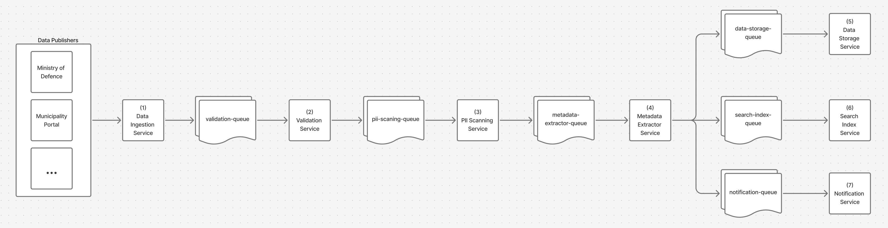

# hackaton-open-overheid-poc

DEUS Federated Data Model for Dutch Gov.

### Setup

1. **Install dependencies:**

  Using uv (recommended):

  ```bash
  uv sync --group dev
  ```

  This installs runtime deps and dev tools like Ruff.

1. **Configure Azure Service Bus:**

- Copy `.env.example` to `.env`
- Update the configuration with your Azure Service Bus details

### Usage



In different terminals, run the following commands:

```bash
  .venv/bin/python validation/validation.py
  .venv/bin/python pii_scanning/pii_scanning.py
  .venv/bin/python metadata_extractor/metadata_extractor.py
  .venv/bin/python data_storage/data_storage.py
  .venv/bin/python search_index/search_index.py
  .venv/bin/python notification/notification.py
```

To launch the initial message, run:

```bash
  .venv/bin/python data_ingestion/data_ingestion.py
```

### Linting

- Check lint errors:

  ```bash
  uv run ruff check .
  ```

- Auto-fix what’s safe:

  ```bash
  uv run ruff check --fix .
  ```

Ruff is configured in `pyproject.toml`.
